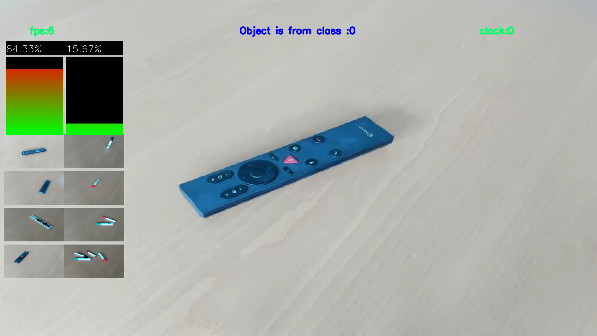

# PEFSL : PYNQ-Embedded Few Shot Learning
This repository contains the code to perform online Few shot Learning with a webcam on FPGA using the [Tensil](https://tensil.ai) framework on the [PYNQ-Z1](http://www.pynq.io/). It also contains the code to evaluate the performance of the network on the dataset cifar-10. Models and algorithms are based on the [EASY paper](https://arxiv.org/abs/2201.09699).

## This is what it looks like:



There are two steps in the demonstration :
- first you need to take a few shots of the classes you want to recognize
- then you can start the inference

Simple as that !

```
Button 0: take a shot with current class
Button 1: switch to the next class
Button 2: start inference
Button 3: reset the demo
```

# How to install and run the demo on the PYNQ board

## Requirements
- PYNQ-Z1
- Webcam USB
- HDMI screen and cable
- Ethernet cable
- SD card (at least 8GB)
- Micro-USB cable

## Installation
1. Download the [PYNQ-Z1 v2.7 image](https://bit.ly/pynqz1_2_7) and flash it on the SD card (see [PYNQ documentation](https://pynq.readthedocs.io/en/v2.7.0/getting_started/pynq_z1_setup.html))
2. Install tensil tcu on the PYNQ: Start by cloning the [Tensil GitHub repository](https://github.com/tensil-ai/tensil) to your work station and then copy `drivers/tcu_pynq` to `/home/xilinx/tcu_pynq` onto your board.
    ```bash
    git clone git@github.com:tensil-ai/tensil.git
    scp -r tensil/drivers/tcu_pynq xilinx@192.168.2.99:
    ```
3. Copy the hardware (bitstream & metadata) and the tensil model files on the PYNQ. Demo files are available [on this link](https://partage.imt.fr/index.php/s/fKkPSYMWR9gjEmK/download).
4. Clone or copy this repository on the PYNQ.

## Run the demo
1. Connect the PYNQ to the screen and the webcam
2. Launch the demo as sudo with environment variables set:

    ```bash
    sudo -E python3 main.py --button-keyboard button --hdmi-display tensil --path_tmodel /home/xilinx/resnet12_32_32_32_onnx_custom_perf.tmodel --path_bit /home/xilinx/design.bit
    ```
3. The demo should be running now on the HDMI screen. You can use the buttons on the PYNQ to interact with the demo as described above.

# How to install and run the demo on your computer
It is also possible to run the demo on your computer using pytorch. Example weights are also available [on this link](https://partage.imt.fr/index.php/s/fKkPSYMWR9gjEmK/download) under the name `cifar.pt1`. In order to run the demo using pytorch:

```bash
python3 main.py pytorch --device-pytorch cpu --path-pytorch-weight cifar.pt1
```
Other backbones examples and weights are available on the EASY repository: https://github.com/ybendou/easy.

The inputs are the following: {1-4} to register shots for classes {0-3}, i to start inference, r to reset the demo.

# Performance evaluation on the dataset cifar-10
It is possible to test the performance of the model on cifar 10 on PYNQ (only 32x32 networks). Download CIFAR 10 test set (cifar-10-batches-py/test_batch) and run the following command :
```
sudo -E python3 few_shot_evaluation.py --dataset-path /home/xilinx/cifar-10-batches-py/test_batch  tensil --path_tmodel /home/xilinx/resnet12_32_32_32_onnx_custom_perf.tmodel --path_bit /home/xilinx/design.bit
```


# other setup :

## test of the performance of the demonstration

You may have problem setting up the hdmi output/ input from camera, and want to verify that the demonstration is running well. In order to do that, setup a video simulation of the demo :

1. download a video and put it in this repo.
2. put reference images inside a folder with the folowing structure :
    -folder
        -class1_name
        -class2_name
3. add the path as argument when you call the function

exemple :
```bash
sudo -E python3 main.py --no-display --use-saved-sample --path_shots_video data/catvsdog --camera-specification catvsdog.mp4 tensil --path_tmodel /home/xilinx/resnet12_32_32_32_onnx_custom_perf.tmodel --path_bit /home/xilinx/design.bit 
```

Get the argument specific to main.py :

```bash
python3 main.py --help
```

Get the argument specific to tensil:

```bash
python3 main.py tensil --help
```

## conversion of models to onnx :

basic setup fo onnx exportation is to export it using torch library, and delete all useless nodes with onnx-simplifier. We included a script model_to_onnx.py in order to convert all the pytorch networks implemented in this repo. Check the description of the file for more info (you need to set the output to output, use opset 10, and avoid certain specific node not implemented by tensil)


# How to train a model, convert it to onnx, then to tensil and finally run it on the PYNQ
## How to train a backbone model
A repository is available to train a model with pytorch: https://github.com/antoine-lavrard/brain-train/tree/few_shot_demo . It is possible to train a model from scratch.
## Conversion to onnx

The script used to convert the model to onnx is [model_to_onnx.py](model_to_onnx.py). Examples to launch the script are in the file. In order to be exported with this script, the networks must be implemented in the demo. Look at [backbone_loader/backbone_pytorch/model.py](backbone_loader/backbone_pytorch/model.py) for a list of supported models. Thus, for the aforementioned models:
```bash
    python model_to_onnx.py --input-resolution 32 --save-name "small-strides-resnet9" --model-type "brain_resnet9_tiny_strided" --model-specification "weights/miniimagenet_resnet9s_32x32.pt" --weight-description "weight retrained on miniimagenet using image size 32"
```
Weights available [on this link](https://drive.google.com/drive/folders/1ftzFL3Byidmls2zS0OdhVA2FBBb2krQR?usp=share_link).

## Conversion to tensil

Use the `onnx_automation.py` script to convert the onnx model to tensil.
Tensil should be installed on your computer. Output files will be saved in the `tensilFiles` folder.
<!--
Once the ONNX model is generated, the next step is to create the .tmodel, .tprog and .tdata files with Tensil. These will allow the model to be implemented on FPGA. The hardware architecture chosen is given by the .tarch file. The steps are as follows:
1. Place the ONNX model in a folder in the directory: `Tensil/networks_onnx`
2. Make sure that there is a folder named "tensilFiles" and a folder "compilation_summaries" in the directory. In the "tensilFiles" folder are saved the Tensil .tmodel, .tprog and .tdata files useful for the rest. In the "compilation_summaries" hfolder are saved the details of the compilation, such as the number of instructions, the memory space used, the number of MAC, etc.
3. Run the onnx_automation.py script which is located in the directory: /home/eleve/projet3AEmbeddedFewShot/Tensil. In this one, you will have to choose the folder containing the ONNX models to convert and the .tarch hardware architecture. The file we have chosen is "custom_per_f.tarch". -->

# Hardware vivado project
Will be provided soon.

# args :
    - For converting model to onnx, exemples are in the docstring of the folder model_to_onnx.py
# Possible pitfall :
    - Sometimes there is a bug with memory allocation (an error is raised). We are investigating it. For now if it happens, just reset the PYNQ.
    - In the PYNQ, always launch the scripts while beeing authentify as root
    - Somethimes PYNQ need to be reset between executions of the program in order to use the hdmi
    - when launching the model, if the tarch of the model does not correspond to the accelerator, the scripts fail silently.
    - the class id must be sequentialy set (first the 0, then 1, ect...)
    - Should be at least enough elements to form queries + n_shots for the evaluation
    - the current implementation of knn expect an even number of samples for every class

